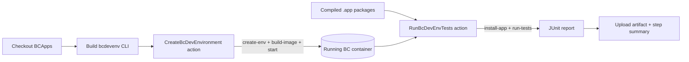

# bcdevenv-based CI/CD for BCApps

This repository ships a redesigned build+test pipeline that uses the
[**bcdevenv**](https://github.com/BusinessCentralApps/bcdevenv) CLI to create the
Business Central environment and run the tests, instead of BcContainerHelper
driven by AL-Go's `RunPipeline`.

It is delivered as **two local GitHub Actions** plus one workflow:

| Piece | Path | Responsibility |
|---|---|---|
| Create environment | [`.github/actions/CreateBcDevEnvironment`](../.github/actions/CreateBcDevEnvironment) | Download a platform artifact, create a fresh platform DB, bake it into a Windows image and start a container |
| Run tests | [`.github/actions/RunBcDevEnvTests`](../.github/actions/RunBcDevEnvTests) | Install the toolkit + apps + test apps and run the suite, producing a JUnit report |
| Workflow | [`.github/workflows/BcDevEnv-CICD.yaml`](../.github/workflows/BcDevEnv-CICD.yaml) | Build bcdevenv, then call the two actions and publish results |

## Why bcdevenv

The classic `Sandbox` artifact ships a *prebuilt* application database snapshot.
When a new platform build lands, that snapshot can stop matching the platform and
the container fails to start. **bcdevenv** sidesteps this by creating a fresh,
empty platform database from the platform artifact and baking it together with
that **same** artifact's service-tier binaries — so schema and platform can never
drift. See the [bcdevenv README](https://github.com/BusinessCentralApps/bcdevenv).

## What changed vs. AL-Go

AL-Go's `_BuildALGoProject.yaml` runs `microsoft/AL-Go/Actions/RunPipeline`,
which uses BcContainerHelper to:

1. Download a full BC artifact and **create a container**.
2. Compile the apps.
3. **Install** the apps + test apps into the container.
4. **Run the tests** and write `TestResults.xml`.

The redesign keeps compilation unchanged and replaces steps 1, 3 and 4:

| RunPipeline / BcContainerHelper step | bcdevenv replacement |
|---|---|
| `New-BcContainer` (create container) | `bcdevenv create-env` + `build-image` + `start` (CreateBcDevEnvironment) |
| `Publish-BcContainerApp` (install apps) | `bcdevenv install-app` (RunBcDevEnvTests) |
| `Run-TestsInBcContainer` (run tests) | `bcdevenv run-tests` (RunBcDevEnvTests) |
| `TestResults.xml` (xUnit) | JUnit report, rendered natively by CI |

## Environment creation action

`CreateBcDevEnvironment`:

1. Resolves a platform version — either an explicit `platformVersion`, or the
   latest build of `platformMajor` from the public platform index
   (`https://bcinsider-fvh2ekdjecfjd6gk.b02.azurefd.net/platform/indexes/platform.json`,
   the same feed bcdevenv's own tests use).
2. Downloads and extracts the platform artifact (cached across runs).
3. Runs `bcdevenv verify`, then `bcdevenv create-env` to build the platform `.bak`.
4. When `startContainer: 'true'` (default), runs `bcdevenv build-image` and
   `bcdevenv start`, then waits for the OData `$metadata` endpoint to answer.

Key outputs: `platformPath`, `environmentName`, `containerName`, `serverInstance`,
`odataUrl` — consumed by the test action.

## Test-running action

`RunBcDevEnvTests`:

1. `bcdevenv install-app` — installs the test toolkit, the apps under test and the
   test apps into the running NST (dependency order: toolkit → apps → test apps).
2. `bcdevenv run-tests` — runs the suite and writes a JUnit report, exiting
   non-zero on any failure (so the build fails). Two paths, same report:
   - `fromXml`: convert an xUnit result document the environment's test tool
     produced (no live call — the reliable CI path).
   - live (default): invoke the toolkit's runner web service over OData v4.

## Requirements

Because BC Server is a Windows service and bcdevenv images are Windows
containers, the pipeline needs a runner that provides:

- **Windows** with Docker in **Windows-container** mode (for `build-image` / `start`).
- A reachable **SQL Server** for `create-env` (local or remote).
- **.NET 10 SDK** (to build the bcdevenv CLI) — installed by the workflow.

These are the same constraints bcdevenv documents; see its README's
"Requirements" and "Not runnable end-to-end in every environment" notes.

## Providing the compiled apps

The redesign scopes bcdevenv to **environment + tests**; AL compilation is
unchanged. The workflow consumes `.app` packages from folders
(`appsFolder`, `testAppsFolder`, `testToolkitFolder`). Point these at the compile
step's output (e.g. AL-Go's `.buildartifacts/Apps`, `.buildartifacts/TestApps`),
or download them from a prior build's artifacts before the test action runs.

## Running it

Trigger **` CI/CD (bcdevenv)`** from the Actions tab (`workflow_dispatch`). Inputs:

- `platformMajor` / `platformVersion` — which platform to build the environment from.
- `appsFolder` / `testAppsFolder` / `testToolkitFolder` — where the compiled apps are.
- `startContainer` — set `false` to only create the platform database (`.bak`).

If `BusinessCentralApps/bcdevenv` is private on your runner, add a repo-scoped PAT
as the `BCDEVENV_TOKEN` secret so the workflow can check it out.
